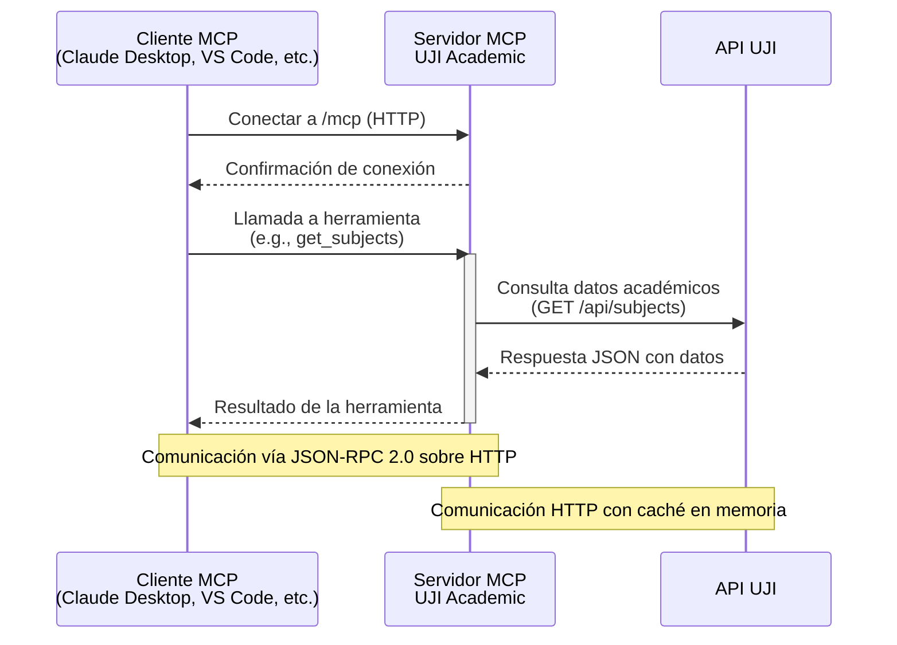

# MCP UJI Academic Server

Servidor HTTP del Model Context Protocol (MCP) que expone la información académica de la Universitat Jaume I (UJI). Permite consultar asignaturas, titulaciones, ubicaciones y calendarios oficiales desde clientes MCP compatibles y desde integraciones HTTP sencillas.

## ✨ Características clave

- 🎓 Acceso unificado a datos académicos (asignaturas, estudios, ubicaciones y horarios)
- 🌐 Soporte multiidioma cuando la API lo proporciona (catalán, español e inglés)
- ⚡ Caché en memoria para reducir llamadas repetidas a la API de la UJI
- 🧰 Ocho herramientas MCP listas para usar y compatibles con MCP Inspector
- 🛡️ Modelos Pydantic y manejo consistente de errores para clientes remotos

## 🏗️ Arquitectura

El servidor MCP UJI Academic actúa como intermediario entre clientes MCP compatibles y la API pública de la Universitat Jaume I, facilitando el acceso a datos académicos a través del protocolo JSON-RPC 2.0.



## 🚀 Inicio rápido

1. **Instala dependencias:** `git clone <repository-url> && cd MCP_UJI_academic && uv sync`
2. **Ejecuta el servidor:** `uv run start_server.py --host 127.0.0.1 --port 8084`
3. **Conecta un cliente MCP:** Usa la URL `http://127.0.0.1:8084/mcp` en tu cliente MCP preferido (ver sección "🤖 Conectar clientes MCP").

Para Docker: `docker compose up` y conecta a `http://localhost:8084/mcp`.

## 🧱 Requisitos previos

- Python 3.12 o superior
- [uv](https://docs.astral.sh/uv/) instalado como gestor de dependencias
- Acceso a internet para consultar la API pública de la UJI
- (Opcional) Docker y Docker Compose para ejecución contenerizada

## 🚀 Instalación y configuración

```bash
git clone <repository-url>
cd MCP_UJI_academic
uv sync
```

## ▶️ Ejecución del servidor

> **Nota:** El servidor debe estar corriendo antes de conectar cualquier cliente MCP. Mantén la terminal abierta o ejecuta en segundo plano.

```bash
# Desarrollo local
uv run start_server.py --host 127.0.0.1 --port 8084

# Servidor accesible desde la red
uv run start_server.py --host 0.0.0.0 --port 8084

# Desarrollo con recarga automática
uv run start_server.py --host 127.0.0.1 --port 8084 --reload
```

> `start_server.py` es un lanzador que arranca `mcp_server.py` con los parámetros indicados. Si prefieres usar directamente Python, ejecuta `python start_server.py`.

## 🐳 Ejecución con Docker

> **Nota:** Asegúrate de que el contenedor esté corriendo antes de conectar clientes MCP. El servidor estará disponible en `http://localhost:8084`.

### Construir y ejecutar la imagen manualmente

```bash
docker build -t mcp-uji-academic .
docker run --rm -p 8084:8084 mcp-uji-academic
```

La API quedará disponible en `http://localhost:8084`. Puedes detener el contenedor con `Ctrl+C` o usando `docker stop` si lo ejecutas en segundo plano.

### Orquestación con Docker Compose

```bash
# Levantar el servicio
docker compose up

# Levantar en segundo plano
docker compose up -d

# Detener y limpiar
docker compose down
```

El archivo `docker-compose.yml` expone el puerto 8084. Ajusta el mapeo si necesitas servirlo en otro puerto host (por ejemplo `- "9090:8084"`).

## 🌐 Endpoints HTTP principales

| Método | Ruta       | Descripción                                                   |
|--------|------------|---------------------------------------------------------------|
| GET    | `/`        | Información básica del servidor                               |
| GET    | `/health`  | Comprobación rápida de estado                                  |
| GET    | `/tools`   | Lista de herramientas MCP y sus esquemas de entrada           |
| POST   | `/mcp`     | Endpoint MCP JSON-RPC 2.0 para clientes compatibles           |

### Servidor remoto de referencia

- URL base: `http://<IP_SERVIDOR_REMOTO>:8084`
- Endpoint MCP: `http://<IP_SERVIDOR_REMOTO>:8084/mcp`
- Health check: `http://<IP_SERVIDOR_REMOTO>:8084/health`

Sustituye la IP por la de tu despliegue cuando publiques el servidor en otro host.

## 🧰 Herramientas MCP disponibles

| Herramienta            | Datos que devuelve                                      | Parámetros principales |
|------------------------|----------------------------------------------------------|------------------------|
| `get_subjects`         | Listado paginado de asignaturas                         | `start`, `limit`, `full` |
| `search_subjects`      | Búsqueda por código o nombre de asignaturas             | `query`, `language`    |
| `get_degrees`          | Catálogo completo de titulaciones                       | `full`                 |
| `search_degrees`       | Búsqueda de titulaciones                                | `query`, `language`    |
| `get_locations`        | Ubicaciones (edificios, aulas, laboratorios)            | `full`                 |
| `search_locations`     | Búsqueda de ubicaciones                                 | `query`                |
| `get_class_schedule`   | Horario lectivo en formato iCalendar                    | `year`, `degree_id`    |
| `get_exam_schedule`    | Calendario de exámenes en formato iCalendar             | `year`, `degree_id`    |

Todas las herramientas devuelven JSON estructurado y, cuando procede, información en múltiples idiomas.

## 🤖 Conectar clientes MCP

> **Importante:** El servidor MCP debe estar corriendo (localmente o en Docker) antes de conectar cualquier cliente. Verifica con `curl http://127.0.0.1:8084/health` o `curl http://localhost:8084/health` para Docker.

### Recomendaciones generales

- El endpoint MCP habla JSON-RPC 2.0 sobre HTTP; cualquier cliente compatible puede usarlo.
- Asegúrate de que el puerto (`8084` por defecto) esté accesible desde tu máquina o túnel SSH.
- Para entornos públicos, añade autenticación o proxies seguros según tus políticas.
- **Si usas Docker localmente:** el servidor estará disponible en `http://localhost:8084/mcp`. Asegúrate de que el contenedor esté corriendo antes de conectar clientes.

### MCP Inspector (`npx`)

```bash
npx @modelcontextprotocol/inspector
```

1. Abre el navegador (suele abrir `http://localhost:3000`).
2. Selecciona **Streamable HTTP** como transporte.
3. Introduce la URL del endpoint (`http://127.0.0.1:8084/mcp` si usas Docker localmente, o `http://<IP_SERVIDOR_REMOTO>:8084/mcp` para el servidor remoto).
4. Pulsa **Connect** y prueba cualquiera de las ocho herramientas disponibles.

### VS Code (extensión MCP)

Añade al `settings.json` del usuario o del workspace:

```json
{
  "mcp.servers": {
    "mcp-uji-academic": {
      "transport": "http",
      "url": "http://127.0.0.1:8084/mcp"
    }
  }
}
```

Si usas un túnel SSH:

```bash
ssh -L 8084:localhost:8084 usuario@IP_SERVIDOR_REMOTO
```

Y cambia la URL a `http://127.0.0.1:8084/mcp`.

### Claude Desktop

Claude Desktop **no** puede llamar a un servidor HTTP remoto por sí mismo: solo lanza comandos locales. Por eso necesitas que el servidor MCP esté disponible en tu máquina **antes** de arrancar Claude.

**Ejecución local con uv:**
Añade a tu `claude_desktop_config.json`:

```json
{
  "mcpServers": {
    "mcp-uji-academic": {
      "command": "uv",
      "args": [
        "run",
        "start_server.py",
        "--host",
        "127.0.0.1",
        "--port",
        "8084"
      ],
      "cwd": "/ruta/completa/a/MCP_UJI_academic"
    }
  }
}
```

**Ejecución con Docker:**
Añade a tu `claude_desktop_config.json`:

```json
{
  "mcpServers": {
    "mcp-uji-academic": {
      "command": "docker",
      "args": [
        "compose",
        "up",
        "-d"
      ],
      "cwd": "/ruta/completa/a/MCP_UJI_academic"
    }
  }
}
```

Esto inicia el contenedor en segundo plano si no está corriendo. Si ya está corriendo, no hace nada.

> `npx @modelcontextprotocol/inspector` es una herramienta de testing. VS Code y Claude necesitan configuraciones JSON propias.

## 🧪 Pruebas y verificación

```bash
# Test de integración (arranca el servidor temporalmente y verifica endpoints)
# Asegúrate de que el puerto 8084 esté libre antes de ejecutar
uv run python integration_test.py

# Checks manuales rápidos
curl http://127.0.0.1:8084/health
curl -X POST http://127.0.0.1:8084/mcp \
  -H "Content-Type: application/json" \
  -d '{"jsonrpc": "2.0", "id": 1, "method": "ping"}'
```

## 📁 Estructura del proyecto

```text
MCP_UJI_academic/
├── api_client.py       # Cliente HTTP con caché y parseo iCalendar
├── integration_test.py # Prueba de arranque y endpoints HTTP
├── mcp_server.py       # FastAPI con endpoints HTTP y MCP JSON-RPC
├── models.py           # Modelos Pydantic para datos académicos
├── start_server.py     # Lanzador de conveniencia
├── pyproject.toml      # Configuración y dependencias
└── README.md           # Documentación (este archivo)
```

## 🛠️ Resolución de problemas

| Problema                                | Cómo solucionarlo |
|-----------------------------------------|--------------------|
| Puerto 8084 ocupado                     | `lsof -i :8084` para identificar el proceso. Mata el proceso o usa `--port 8001` para cambiar el puerto. |
| Timeout o conexión rechazada            | Verifica que el servidor esté corriendo con `curl http://<host>:8084/health`. Comprueba firewall o túnel SSH. |
| Dependencias inconsistentes con uv      | Ejecuta `uv sync --reinstall` para reinstalar dependencias. |
| Errores de la API pública de la UJI     | Revisa los logs del servidor; la API puede ser lenta o intermitente. Reintenta más tarde. |
| Docker: contenedor no responde          | Asegúrate de que el puerto esté mapeado correctamente (`-p 8084:8084`). Usa `docker logs <container_id>` para ver logs. |
| Claude Desktop no conecta               | Verifica que el comando en `claude_desktop_config.json` sea correcto y que `cwd` apunte a la ruta del proyecto. Reinicia Claude. |

## 🌍 API externa usada

- Base URL: `https://ujiapps.uji.es/lod-autorest/api/`
- Datos disponibles: asignaturas, estudios, ubicaciones y calendarios en JSON/iCalendar

## 📄 Licencia y soporte

- Licencia: MIT
- ¿Dudas o incidencias? Abre un issue, revisa la tabla de solución de problemas o ejecuta el test de integración antes de reportar.

---

Proyecto creado para facilitar el acceso programático a la información académica de la UJI dentro del ecosistema MCP. ¡Aprovecha y automatiza tus flujos educativos!
